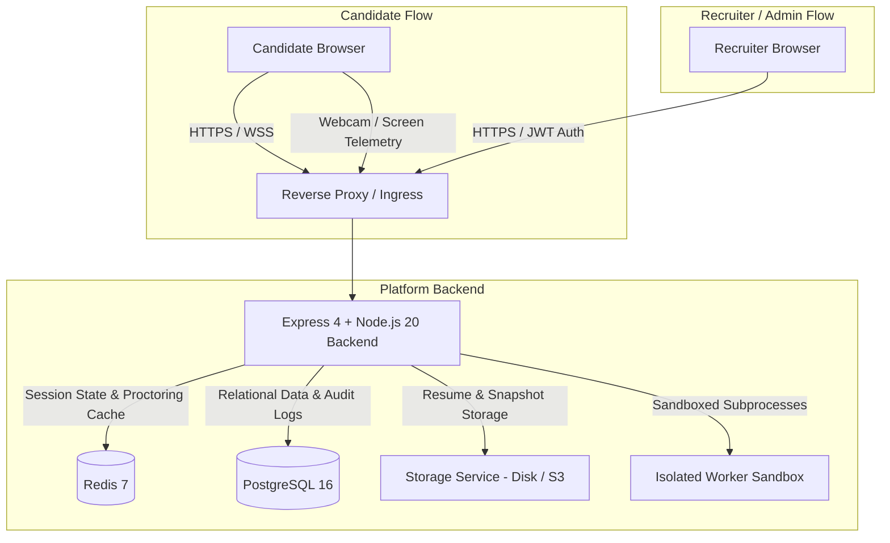

# TechScreen Pro — System Architecture & Security Specification

## 1. Executive Summary

TechScreen Pro is an automated technical screening and real-time proctored assessment platform built for modern engineering hiring teams. The platform automates the end-to-end recruitment pipeline: job creation, resume ingestion with skill matching, candidate invitation dispatch, OTP authentication, locked-down proctored examination, sandboxed code execution, automated scoring, and comprehensive recruiter analytics.

This document outlines the complete architectural topology, multi-tenant security guarantees, isolation boundaries, proctoring telemetry mechanisms, and operational invariants implemented across the codebase.

---

## 2. High-Level System Architecture

---

## 3. Core Architectural Modules

### 3.1 Authentication & Multi-Tenant RBAC (`server/src/middleware/auth.ts`)
- **Authoritative Roles**: Roles (`ADMIN`, `HR_ADMIN`, `RECRUITER`, `TECH_INTERVIEWER`) are strictly loaded from the PostgreSQL `User` table during JWT generation.
- **Client Role Stripping**: Client-supplied role claims or requested elevations in request bodies are ignored.
- **Tenant Scoping**: All recruiter endpoints enforce `companyId` filtering (`req.user.companyId`), preventing cross-company access (Anti-IDOR).
- **Password Security**: Passwords are salted using `crypto.randomBytes(16)` and hashed via PBKDF2 (100,000 iterations, SHA-512). Plaintext passwords are never stored.

### 3.2 Candidate Assessment Isolation & Anti-IDOR (`server/src/middleware/assessmentAuth.ts`)
- **Dual-Mode Access Control**: Assessment attempt endpoints (`/api/assessment/*`) accept either:
  1. A valid Recruiter/Admin JWT for the owning company.
  2. A candidate assessment token header (`x-assessment-token`) matching the candidate's active `JobApplication`.
- **Active State Guard**: `requireActiveAttempt` rejects answer submissions or proctoring modifications once an assessment is marked `isCompleted: true`.
- **Attempt Boundaries**: Cross-attempt access is completely blocked: candidate tokens only grant access to their specific attempt ID.

### 3.3 Candidate OTP Hardening (`server/src/services/AssessmentEngine.ts`)
- **Cryptographic Hashing**: Plaintext OTP codes are never persisted in the database. Only `otpCodeHash` (`crypto.createHash('sha256')`) is stored.
- **Response Scrubbing**: OTP codes are excluded from API response payloads.
- **Rate Limiting & Cooldown**: A strict 30-second cooldown is enforced between resend requests.
- **Brute-Force Defense**: Verification is automatically locked out after 5 consecutive failed attempts.
- **Single-Use Invalidation**: Once verified, the OTP hash and expiry are immediately set to `null` to prevent replay attacks.

### 3.4 Answer-Key & Question Security (`server/src/services/AssessmentEngine.ts`)
- **Server-Side Grading**: Answers are evaluated against database records during final assessment evaluation.
- **Answer Sanitization**: `getQuestionAtIndex` sanitizes options before serving them to the client (`isCorrect` and `explanation` are filtered out).
- **Hidden Test Case Protection**:
  - `sampleTestCases` served to candidates only include test cases with `isHidden: false`.
  - In code preview runs (`POST /run-code`), hidden test case inputs and outputs are masked (`[Protected Output]`).

### 3.5 Proctoring Telemetry & Anti-Cheating Pipeline (`server/src/services/ProctoringService.ts`)
- **Event Whitelist**: Only authenticated, whitelisted event types (`FOCUS_LOST`, `FULLSCREEN_EXIT`, `SCREEN_SHARE_STOPPED`, `CAMERA_DISABLED`, `MIC_DISABLED`, `COPY_PASTE`, `RIGHT_CLICK`, `SUSPICIOUS_BEHAVIOR`) are accepted.
- **Rapid Bounce Deduplication**: Duplicate events within 3 seconds are debounced to prevent unfair score degradation from OS window focus bounces.
- **Sliding-Window Rate Limiting**: Maximum 20 proctoring events per minute per attempt prevents event flooding DOS attacks.
- **Webcam Snapshot Security**:
  - Magic-byte validation (`JPEG`, `PNG`, `WEBP`) ensures only valid image data is saved.
  - Buffer limit enforced at 2MB.
  - Snapshot uploads are throttled to a minimum of 5 seconds between frames.
  - Benign periodic snapshots (`WEBCAM_SNAPSHOT`) do not penalize candidate integrity scores.
- **Composite Integrity Score**: Real-time calculation:
  $$\text{Integrity Score} = \max(0, 100 - \text{Proctoring Risk Score})$$
  $$\text{Risk Level} = \begin{cases} \text{HIGH} & \text{if } \text{Risk} \ge 61 \\ \text{MEDIUM} & \text{if } \text{Risk} \ge 31 \\ \text{LOW} & \text{otherwise} \end{cases}$$

### 3.6 Code Execution Sandbox (`server/src/services/CodeExecutionService.ts`)
- **Static Security Screening**: Pre-execution AST and regex inspection blocks dangerous modules and primitives before spawning any sub-process:
  - *JavaScript / TypeScript*: Blocks `child_process`, `fs`, `net`, `http`, `os`, `vm`, `cluster`, `worker_threads`, `process.env`, `process.exit`, `eval()`, `Function()`, `__proto__`.
  - *Python*: Blocks `os`, `sys`, `subprocess`, `shutil`, `socket`, `open()`, `eval()`, `exec()`, `__import__`, `__class__`.
- **Process Isolation**: Code runs in a dedicated child process with stripped environment variables (`NODE_ENV: 'production'`, no access to `DATABASE_URL` or `JWT_SECRET`).
- **Strict Timeouts**: 3,500ms hard ceiling with `SIGKILL` termination.
- **Output Buffering**: 256KB buffer ceiling prevents memory exhaustion from output loops.
- **Scratch Directory Cleanup**: Sandbox files in `/tmp/techscreen_sandbox` are automatically cleaned up in `child.on('close')`, with background sweep of files older than 5 minutes.

### 3.7 Resume Parsing & Storage Security (`server/src/services/StorageService.ts`)
- **Path Traversal Prevention**: Strict validation on file paths prevents `../` path traversal outside `uploads/`.
- **Magic-Byte Header Validation**: Rejects Windows PE executables (`MZ`), Linux ELF binaries (`\x7fELF`), and shell scripts (`#!`). Enforces legitimate PDF (`%PDF`) and Microsoft Office docx headers.
- **File Size Ceiling**: Enforces 5MB maximum file size limit.

---

## 4. Database Schema Specification (PostgreSQL + Prisma)

| Model | Primary Responsibilities |
|---|---|
| `Company` | Multi-tenant tenant boundary; owns jobs, users, templates, and webhooks. |
| `User` | Recruiter/Admin accounts with salted password hashes and roles. |
| `AssessmentTemplate` | Reusable test configurations with sections and pass thresholds. |
| `AssessmentSection` | Thematic test sections (e.g. Git, Linux, Docker, Coding). |
| `Question` | Single/multi-choice or coding problems with hidden/sample test cases. |
| `QuestionOption` | Option choices with `isCorrect` flags (server-side only). |
| `Job` | Active job openings attached to assessment templates. |
| `Candidate` | Candidate identity and resume storage references. |
| `JobApplication` | Application state (`INVITED`, `STARTED`, `IN_PROGRESS`, `PASSED`, `FAILED`, `MANUAL_REVIEW`), tokens, and OTP hashes. |
| `AssessmentAttempt` | Active test attempts, server timers, proctoring violations, and integrity scores. |
| `CandidateAnswer` | Candidate question submissions and timestamps. |
| `AssessmentResult` | Final evaluation report, breakdown by section, and ranking scores. |
| `ProctoringLog` | Timestamped proctoring violation logs and snapshot references. |
| `AuditLog` | Audit trail of administrative and recruiter actions. |

---

## 5. Security & Compliance Invariants

1. **No Plaintext Passwords or OTPs**: Passwords use PBKDF2; OTPs use SHA-256 hashes.
2. **Zero Client Trust on Evaluation**: Scores and question timers are calculated exclusively by the backend engine.
3. **Fail-Fast Secret Validation**: In production (`NODE_ENV=production`), the application refuses to start if `JWT_SECRET` is missing, shorter than 32 characters, or contains known weak defaults.
4. **Defense in Depth**: Every API endpoint enforces role checks, tenant isolation, input validation, and HTTP security headers (`nosniff`, `DENY`, `strict-origin-when-cross-origin`).
